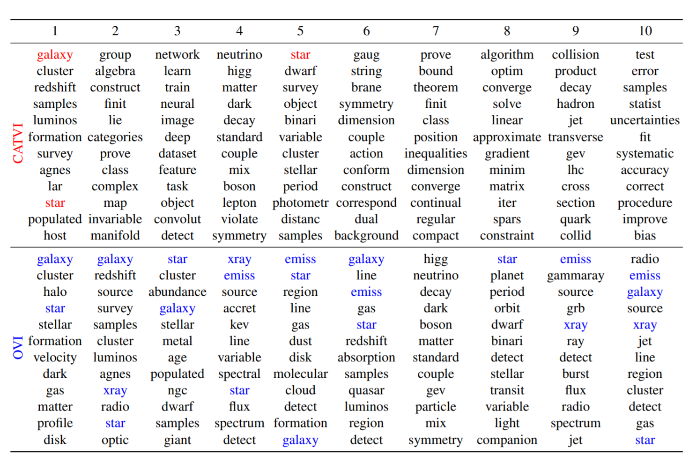

# 
# CATVI: Conditional and Adaptively Truncated Variational Inference for Hierarchical Bayesian Nonparametric Models

This repository contains the implementation for the paper "CATVI: Conditional and Adaptively Truncated Variational Inference for Hierarchical Bayesian Nonparametric Models" in Python.

## Summary of the paper

Current variational inference methods for hierar-chical Bayesian nonparametric models can nei-ther characterize the correlation structure amonglatent variables due to the mean-field setting, norinfer the true posterior dimension because of theuniversal  truncation.   To  overcome  these  limi-tations,  we  propose  the  conditional  and  adap-tively   truncated   variational   inference   method(CATVI) by maximizing the nonparametric ev-idence lower bound and integrating Monte Carlosampling into the stochastic variational inferenceframework.   CATVI  enjoys  several  advantagesover  traditional  variational  inference  methods,including  a  smaller  divergence  between  varia-tional  and  true  posteriors,  reduced  risk  of  un-derfitting or overfitting, and improved predictionaccuracy.    The  empirical  study  on  three  largedatasets,arXiv,New York TimesandWikipedia,reveals that CATVI applied in Bayesian nonpara-metric  topic  models  substantially  outperformsthe competitors in terms of lower perplexity andmuch clearer topic-words clustering.



## Usage
Here is a small example to use CATVI (Python 3):

```python
from src.CATVI import HdpModel_CATVI

model = HdpModel_CATVI(corpus=corpus[index_train], corpus_test=corpus[index_test], id2word=id2word)

model.fit()

model.output()
```
See [the tutorial](https://github.com/yiruiliu110/ConditionalVI/blob/master/tutorial/train_hdp_catvi.md) for more details.

## Requirements

Change your working directory to this main folder.

CATVI requires Python 3.7+ and the following packages:
numpy >= 1.11   scipy >= 1.6.1     pandas >= 0.18    scikit_learn >= 0.24     gensim >= 3.8.3  


## Contributing

All contributions welcome! All content in this repository is licensed under the MIT license.
